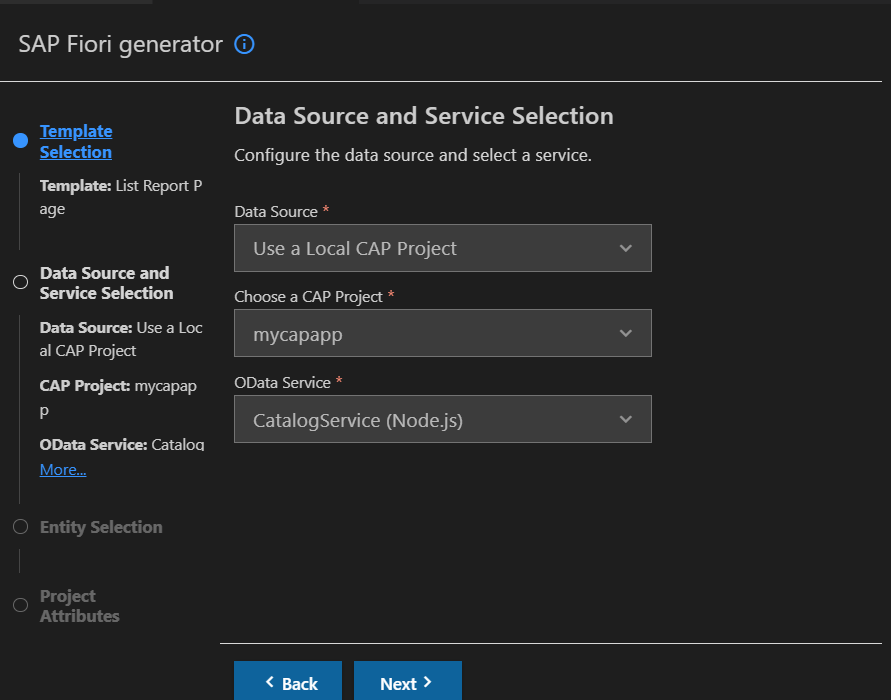
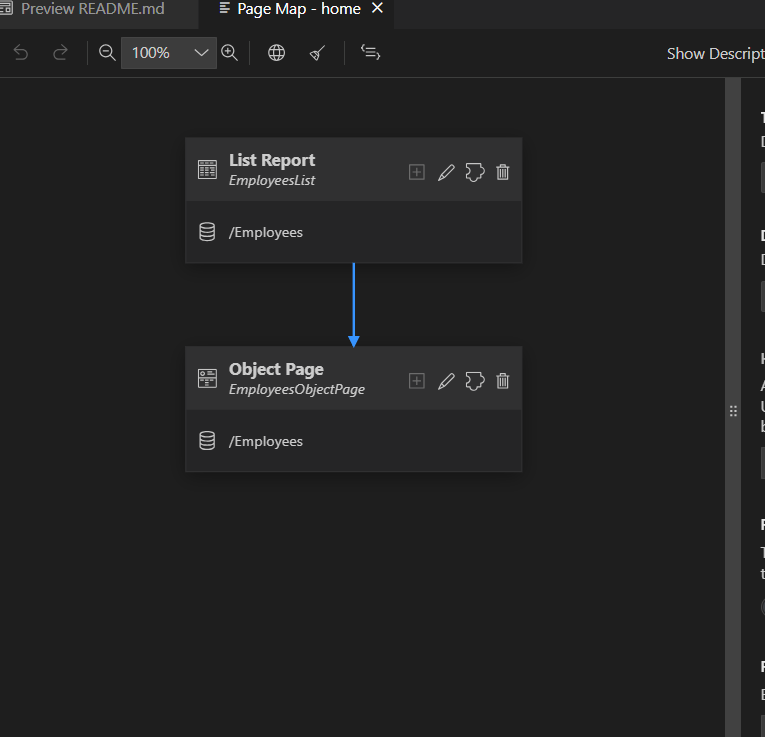
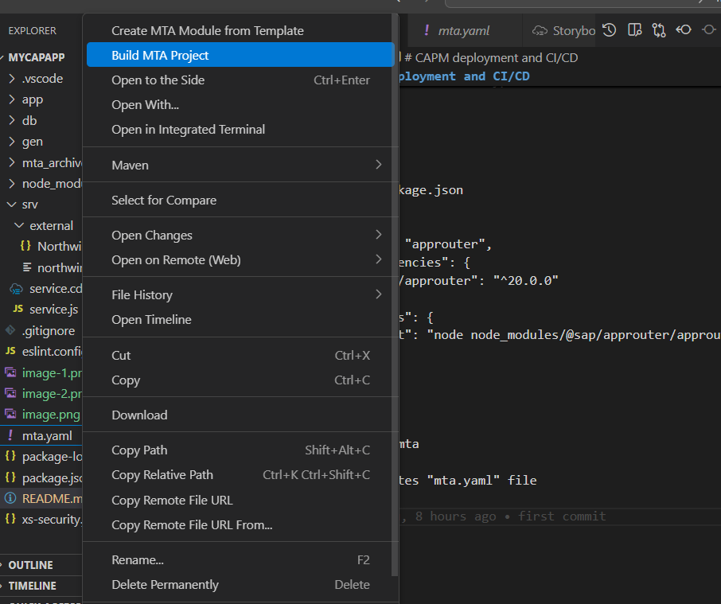
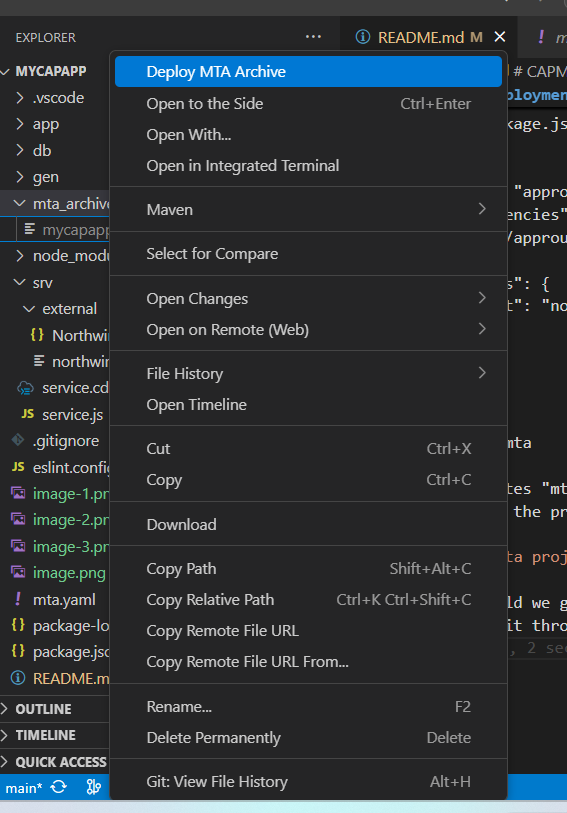
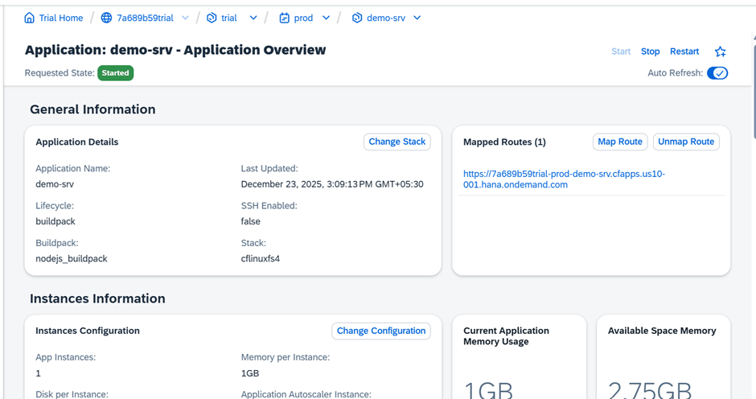
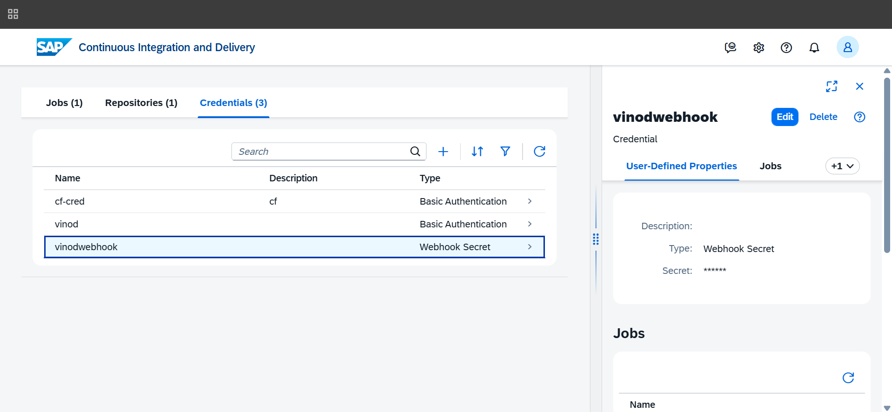
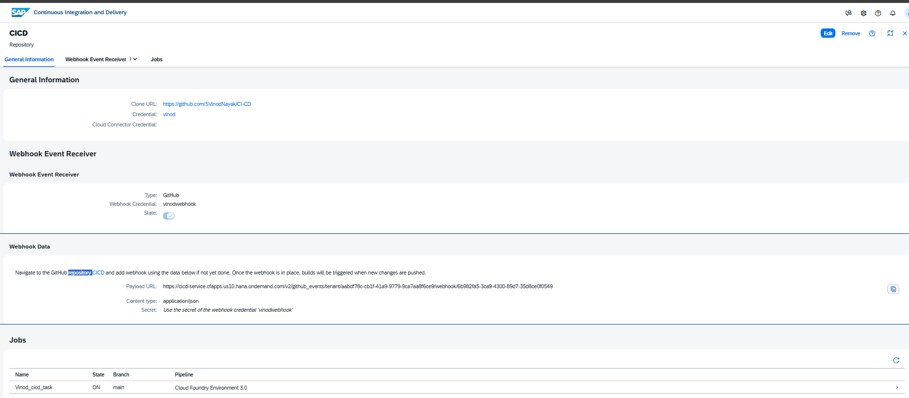
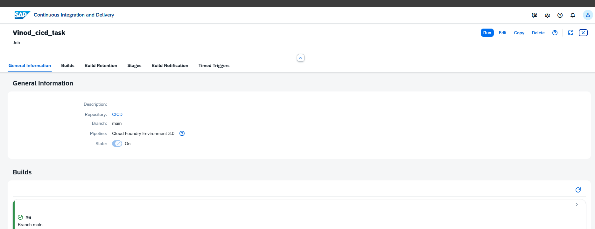
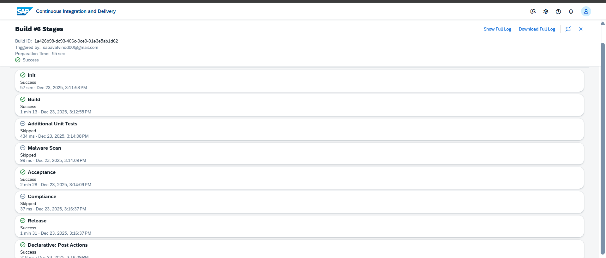

# CAPM deployment and CI/CD

## Git hub : https://github.com/SVinodNayak/CI-CD
>db
-->schema.cds
```namespace mycap;

entity Employees @(
    label: 'Employee Data'
) {

    key ID     : UUID ;
    name       : String(50) @assert.notEmpty;
    position   : String(50);
    salary     : Integer;
}
annotate mycap.Employees with @(
  grant: [
    {role:'Admin', permission:'READ,WRITE'},
    {role:'Viewer', permission:'READ'}
  ]
);

```
>calling external api throughr storyboard


>srv-->service.cds

```
using mycap from '../db/schema';
using { Northwind as external } from './external/Northwind';

service CatalogService {

    @odata.draft.enabled
    entity Employees as projection on mycap.Employees;

    entity Customers as projection on external.Customers;

}
```
>srv-->service.js
```
const cds = require("@sap/cds");

module.exports = cds.service.impl(async function () {

  const { Employees } = this.entities;
  const northwind = await cds.connect.to("Northwind");

  this.on("READ", "Customers", async req => {
    return northwind.run(req.query);
  });

  this.before("CREATE", Employees, req => {
    console.log("Creating employee");
  });

  this.on("CREATE", Employees, async req => {
    return req.data;
  });

  this.on("DELETE", Employees, async req => {
    console.log("Deleting employee");
  });

});
```
> run cds add data
>>run  locally "cds watch"

>package.json

Generate fiori 
--> List report page






>app>home>annotations.cds
```
using CatalogService as service from '../../srv/service';
annotate service.Employees with @(
    UI.FieldGroup #GeneratedGroup : {
        $Type : 'UI.FieldGroupType',
        Data : [
            {
                $Type : 'UI.DataField',
                Label : 'name',
                Value : name,
            },
            {
                $Type : 'UI.DataField',
                Label : 'position',
                Value : position,
            },
            {
                $Type : 'UI.DataField',
                Label : 'salary',
                Value : salary,
            },
        ],
    },
    UI.Facets : [
        {
            $Type : 'UI.ReferenceFacet',
            ID : 'GeneratedFacet1',
            Label : 'General Information',
            Target : '@UI.FieldGroup#GeneratedGroup',
        },
    ],
    UI.LineItem : [
        {
            $Type : 'UI.DataField',
            Label : 'name',
            Value : name,
        },
        {
            $Type : 'UI.DataField',
            Label : 'position',
            Value : position,
        },
        {
            $Type : 'UI.DataField',
            Label : 'salary',
            Value : salary,
        },
    ],
);


```

>cds add xsuaa
```
{
  "xsappname": "capm-app",
  "tenant-mode": "dedicated",
  "scopes": [
    {
      "name": "$XSAPPNAME.admin"
    },
    {
      "name": "$XSAPPNAME.viewer"
    }
  ],
  "role-templates": [
    {
      "name": "Admin",
      "description": "Admin role",
      "scope-references": [
        "$XSAPPNAME.admin"
      ]
    },
    {
      "name": "Viewer",
      "description": "Viewer role",
      "scope-references": [
        "$XSAPPNAME.viewer"
      ]
    }
  ],
  "attributes": [],
  "authorities": [
    "$ACCEPT_GRANTED_AUTHORITIES"
  ],
  "oauth2-configuration": {
    "token-validity": 9000,
    "redirect-uris": [
      "https://*.cfapps.us10-001.hana.ondemand.com/login/callback"
    ]
  },
  "xsenableasyncservice": "true"
}

```
>cds add appouter
>>router folder get generated: 

app : xs-app.json
```
{
  "welcomeFile": "/home/webapp/index.html",
  "authenticationMethod": "route",
  "sessionTimeout": 100,
  "pluginMetadataEndpoint": "/metadata",
  "routes": [
    {
      "source": "^/home/wwebapp(.*)$",
      "target": "$1",
      "localDir": "home/webapp",
      "authenticationType": "xsuaa"
    },
    {
      "source": "^/(.*)$",
      "destination": "srv-api",
      "authenticationType": "xsuaa"
    }
  ]
}

```
app : package.json
```
{
  "name": "approuter",
  "dependencies": {
    "@sap/approuter": "^20.0.0"
  },
  "scripts": {
    "start": "node node_modules/@sap/approuter/approuter.js"
  }
}

```
>cds add mta

It generates "mta.yaml" file 
and build the project through cmd "mbt build"



After build we get new folder named "mta_archieve"
. deploy it through command "cf deploy "mtarfilename"



## After Deployment





# CI-CD

# creating credentials
### 1. Basic authentication
### 2. webhook secret



## Repository 



## creating Jobs



### Run the Job

